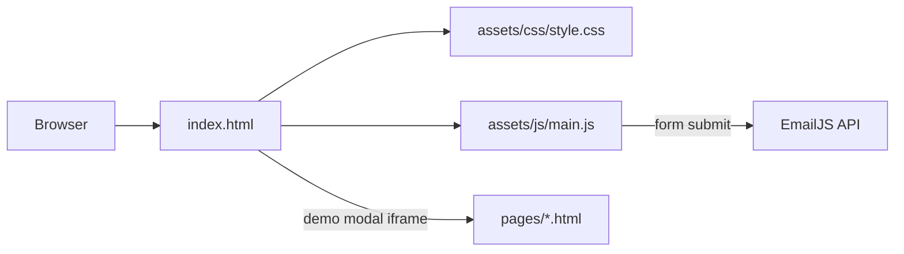

<div align="center">

# TechCabana.github.io

**Ankhit Sharma's personal portfolio: work history, skills and project deep-dives**

[](LICENSE)
[](https://github.com/TechCabana/techcabana.github.io)
[](#)
[](https://github.com/TechCabana/techcabana.github.io/commits/main)

[Live site](https://techcabana.github.io/) ·
[Overview](#overview) ·
[Installation](#installation) ·
[Architecture](#architecture) ·
[Contributing & Licence](#contributing--licence)

</div>

---

> **TL;DR:** A hand-written, single-page portfolio with no framework and no build step, published straight from `main` to GitHub Pages.

## Overview

This is a single-page portfolio: an introduction, a work history, a skills matrix, four project deep-dives, education and a contact form. It is hand-written HTML, CSS and one plain JavaScript file, served directly by GitHub Pages with no framework, no build step and no package manager. Because the repository is named `TechCabana.github.io`, a push to `main` is a deploy, so every change here reaches the live site within a minute.

The work history covers six roles across product management, data governance and delivery, described by outcome rather than job title. The skills matrix groups six categories and filters by level. Each of the four projects opens its own deep-dive page in place, inside a modal, rather than navigating away from the main page.

### Goal

Give a recruiter or a visitor a fast, accessible page that loads on a phone in one hop, with project detail available on demand rather than upfront.

### Scope

| In scope | Not in scope |
| --- | --- |
| A single static page: intro, work history, skills, project showcase, contact | A CMS, database or any server-side logic |
| Deep-dive pages for individual projects, opened in a modal | A blog, multi-page site, or client-side routing |
| A public contact form via a client-side email service | User accounts, comments, or any form of persistence |

---

## Installation

### Prerequisites

| Requirement | Version | Notes |
| --- | --- | --- |
| A modern browser | any current release | No build tooling or package manager needed |
| A static file server | any | Optional, but better than opening `index.html` directly (see below) |

### 1. Clone

```bash
git clone https://github.com/TechCabana/techcabana.github.io.git
cd techcabana.github.io
```

### 2. Install

Nothing to install. There is no `package.json` and no dependency manager. The three CDN
scripts (Google Fonts, EmailJS, particles.js) load straight from `index.html`.

### 3. Run

```bash
npx serve .
# or
python -m http.server 8000
```

### 4. Verify

Open the printed URL. You should see the hero section with an animated particle background,
a working nav bar, and the projects grid below it.

Serving the directory rather than opening `index.html` via `file://` matters for the deep-dive
pages: they load inside an `<iframe>` from the projects grid, and some browsers restrict
`file://` iframes in ways that don't match how GitHub Pages serves the site.

### 5. Configure

No environment variables or secrets are required to run the site. The EmailJS keys already
committed in `index.html` are intentionally public: EmailJS authorises by origin allowlist,
not by keeping the key secret, so there is nothing to move into an env file.

### If it does not work

| Symptom | Cause | Fix |
| --- | --- | --- |
| Hero particle background is missing | The `particles.js` CDN request was blocked | Check the browser's network tab for a failed request to the CDN and retry |
| Contact form submission silently fails | The page's origin is not on the EmailJS allowlist | Check the allowlist in the EmailJS dashboard for the service tied to the keys in `index.html` |
| A project's deep-dive page won't open | Served over `file://` instead of a local HTTP server | Serve the directory as in step 3 above |

---

## Architecture

### Tools and technologies


| Layer | Choice | Why this one |
| --- | --- | --- |
| Language | HTML, CSS, vanilla JavaScript | No compile step between the source and what ships |
| Runtime | The visitor's browser | The whole site is client-side; there is nothing running on a server |
| Storage | None | No database or persisted state anywhere |
| Hosting | GitHub Pages, legacy Jekyll builder, serving `main` at the repository root | A push to `main` deploys directly, with no intermediate workflow |
| Automation | None | No CI, no scheduled jobs; verification is a manual checklist run before every PR |
| Testing | None | No automated suite; see the note at the end of this section |

### How the pieces fit



<!-- ASCII fallback:
```
   browser              index.html               pages/*.html
     │                       │                         │
     └──────────────────────>└───(demo modal iframe)──>│
                              │
                              └──(form submit)──> EmailJS API
```
-->

### End to end walk-through

1. GitHub Pages serves `index.html` directly from `main`; there is no build step in between.
2. `assets/js/main.js` wires up nav scrolling, the skills filter, a toast helper, the contact
   form and the demo modal once the page loads.
3. Clicking a project card's arrow button reads its `data-demo-src` attribute and points the
   modal's `<iframe>` at the matching file in `pages/`.
4. Each deep-dive page in `pages/` links the same `assets/css/style.css` for design tokens and
   redeclares the shared `demo-page` class vocabulary in its own inline `<style>` block.
5. Submitting the contact form calls the EmailJS browser SDK directly from `main.js`; the
   request goes straight from the visitor's browser to EmailJS, with no backend in between.

<details>
<summary><b>Why this approach, and what was rejected</b></summary>

| Decision | Alternative considered | Why the choice was made |
| --- | --- | --- |
| No framework or build step | A static-site generator or a bundled framework build | The site is small and single-purpose; a build step would add a failure point between a commit and the live deploy for no real benefit |
| Deep-dive pages open in a modal iframe | A separate route or page per project | Keeps the visitor on the main page rather than resetting scroll position and the hero animation on every project click |
| EmailJS for the contact form | A custom backend endpoint | The site is static with no server; EmailJS authorises by origin allowlist, which lets the publishable key live in the client safely |

</details>

<details>
<summary><b>Project structure</b></summary>

```
techcabana.github.io/
├── index.html              single-page site: nav + 7 sections + demo modal
├── assets/
│   ├── css/style.css       all styling; design tokens live in :root
│   ├── js/main.js          nav, scroll, filters, toast, contact form, demo modal
│   └── images/             project thumbnails and screenshots
├── pages/                  one deep-dive page per project, opened in the demo modal
│   ├── familytree.html
│   ├── utilitytool.html
│   ├── wordoftheday.html
│   └── yugioh.html
└── README.md
```

| Path | Role |
| --- | --- |
| `index.html` | The entire single-page site |
| `assets/css/style.css` | All styling; every colour is a token in `:root` |
| `assets/js/main.js` | All page behaviour |
| `pages/*.html` | Project deep-dive pages, each its own document opened inside an iframe |
| `assets/images/` | Project thumbnails, screenshots, and mirrored card art under `images/yugioh/` |

</details>

---

## Contributing & Licence

### Contributing

This is a personal portfolio maintained by one person, not a project looking for
contributors. If something is genuinely broken, an issue is welcome; unsolicited pull
requests are unlikely to be the right path for a site like this one.

### Licence

**TODO(owner):** there is no `LICENSE` file in this repository. Without one, the default
under copyright law is all rights reserved: nobody else may copy, modify or redistribute
this code. The License badge above reflects this and will show `NOASSERTION` rather than a
named licence until one is added, if ever.

### Credits and third-party terms

- Typefaces: [Bricolage Grotesque](https://fonts.google.com/specimen/Bricolage+Grotesque),
  [Inter](https://fonts.google.com/specimen/Inter) and
  [JetBrains Mono](https://fonts.google.com/specimen/JetBrains+Mono), served by Google Fonts
  under the SIL Open Font License.
- [particles.js](https://github.com/VincentGarreau/particles.js) by Vincent Garreau, MIT
  licence.
- [EmailJS](https://www.emailjs.com/) browser SDK, used under its terms of service.
- Card artwork under `assets/images/yugioh/` comes from [YGOPRODeck](https://ygoprodeck.com/)
  and is mirrored rather than hotlinked, at their request. *Yu-Gi-Oh!* and all card names and
  artwork are trademarks of Konami; this project is unaffiliated and carries no endorsement.

---

<div align="center">

<sub>Built and maintained by <a href="https://github.com/TechCabana">TechCabana</a></sub>

</div>
